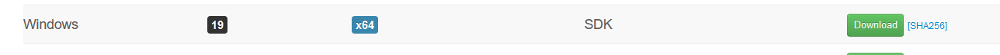

[TODO] Installation Manual deliverable

This page should contain a detailed description of the product installation procedure and all its steps, including installation of third-party software if thus required for the product to operate. 

In order to use Schedula, the Calendar App, some steps are needed to be taken.
First, there are some files to be downloaded.
1. The javafx sdk file. In order to install it go to this page: https://gluonhq.com/products/javafx/, and scroll down until you see the downloads and download the javafx sdk for your computer architecture. Normally it would be the x64 architecture as seen below.

2. 