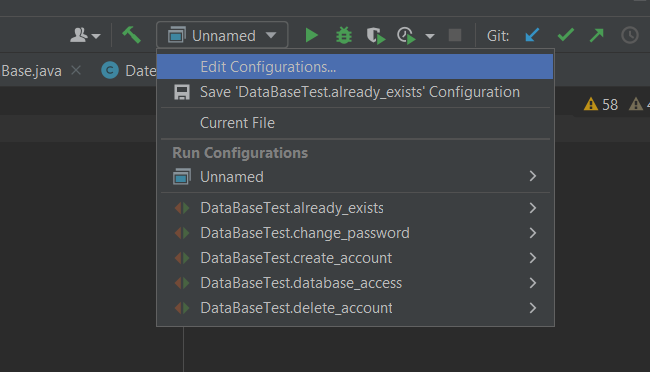
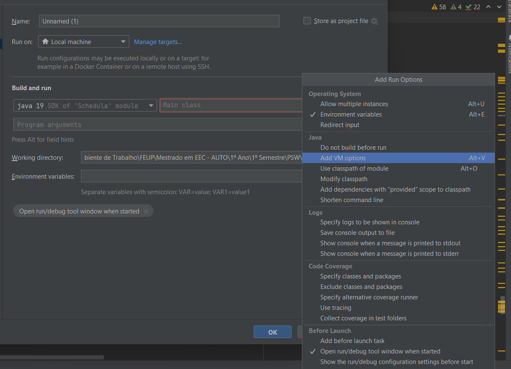

In order to use Schedula, the Calendar App, some steps are needed to be taken.
First, there are some files to be downloaded.
1. The javafx sdk file. In order to install it go to this page: https://gluonhq.com/products/javafx/, and scroll down until you see the downloads and download the javafx sdk for your computer architecture. As an example, the x64 architecture for Windows as seen below.

After the file is downloaded just extract it to a folder of your choice.
2. The sql jar so the app can connect to the database. In order to install it go to this page: https://jdbc.postgresql.org/download/ and install the jar according to your version of java.

After you have these two files go to File - Project Structure - Libraries and click on the plus icon to add the sql jar file and the "C:\..\javafx-sdk-19\lib" to the project as an IDE dependency.

Consequently, when you go to run the program, on its left it should say the program you want to run. Click on it and it should appear a dropdown menu with the Run Configurations. The first choice should be "Edit Configurations" as seen below.

Click on this option and click on the plus icon to "Add a new configuration". When doing this, add an Application. Now, on the right of the screen you have some fields left to fill. Go to "Modify Options" and on the Java field, choose "Add VM options" as presented below.

After this, in the VM options field add this: "--module-path ${PATH_TO_FX} --add-modules javafx.fxml,javafx.controls,javafx.graphics", replacing the ${PATH_TO_FX} with the path to the javafx sdk lib directory. So in my case, as an example, it would be like this: "--module-path "C:\Users\ritat\OneDrive\Ambiente de Trabalho\FEUP\Mestrado em EEC - AUTO\1º Ano\1º Semestre\PSW\TRABALHO\javafx-sdk-19\lib" --add-modules javafx.fxml,javafx.controls,javafx.graphics" - don't forget it's the lib folder! 
Consequently, in the Main class field just choose the "HelloApplication". You can also add a name to your liking if you want, like "Schedula" for example. Save your changes.

Afterwards, connect to the FEUP VPN if you are not already connected and you should be able to run the program smoothly! Have fun!