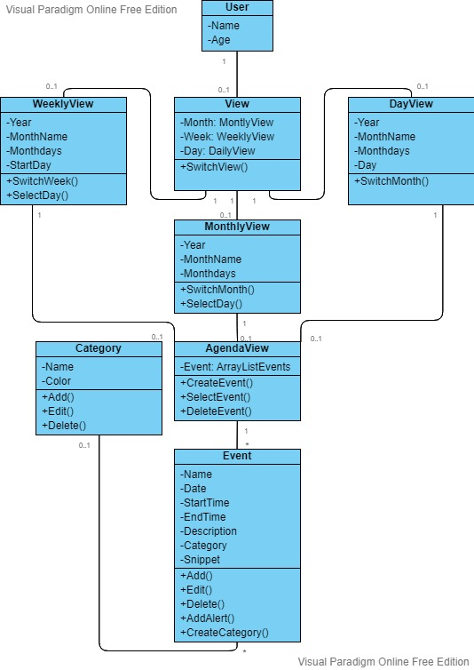

[TODO] UML Class Diagram deliverable

The overall class diagram, depicting the system architecture. It might be a set of diagrams if the system is composed of several components. Nevertheless, relationships between elements (classes or interfaces) of different components must be clearly depicted. 

Try to make the class diagram as complete as possible, yet readable. You should keep it updated (at least by the end of each sprint) to reflect the current application architecture, as it evolves. 