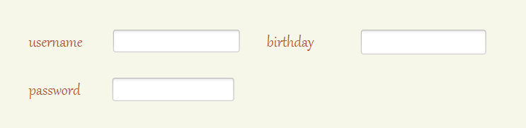
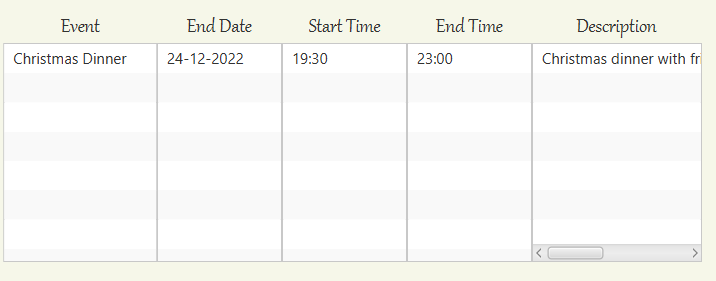
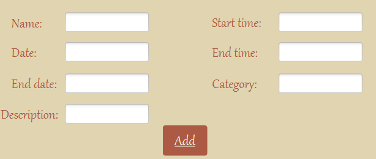

[TODO] User Manual deliverable

This page should contain the product User Manual, describing how to operate the system to use its functionalities (from an End-User perspective)

First, in order to start planning your events, you need to have an account in Schedula. So, when you run the application, there will be 2 options for you to choose, "Login" or "Create an account". In the second option, you will have to fill in the following parameters:

However, there are some restrictions in the birthday and password fields. In the first one, you should enter your birthday in the format dd-mm-yyyy. Related to the password, you need to have more than 6 characters in order to successfully create your account. 
After that, you will see your welcoming page which have a button "Daily View" that leads you to your Daily View where you can see your daily events. When you click on "Daily View", you'll have an date picker that will then open the daily view in the day chosen. On this view, you have 4 buttons: show events, add event, delete event and change event. 
For you to see your events on the selected day, you press the "Show events" button. Your events will appear as shown below.

To add an event to your account, you click on the "Add event" button. By doing this, it will apear to you the following fields to complete: 

When entering the information to your events you need to respect the following rules: 
- You can't have events with the same name;
- The format of the dates are the same as when creating an account (dd-mm-yyyy);
- The format of the hours are hh:mm.
After filling in all the blanks, you can now add your event by pressing the "Add" button. 