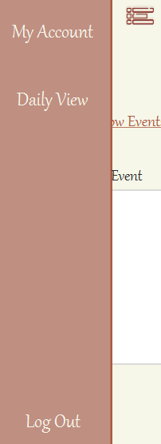

[TODO] User Manual deliverable

This page should contain the product User Manual, describing how to operate the system to use its functionalities (from an End-User perspective)

First, in order to start planning your events, you need to have an account in Schedula. So, when you run the application, there will be 2 options for you to choose, "Login" or "Create an account". In the second option, you will have to fill in the following parameters:

However, there are some restrictions in the fields. In the username field, you must create an account with a username that does not already exist. In the birthday field, you should enter your birthday in the format dd-mm-yyyy. Related to the password, you need to have more than 6 characters in order to successfully create your account.
An event with your birthday will be created wishing you a happy birthday!

After that, you will see your welcoming page which has a button "Daily View" that leads you to your Daily View where you can see your daily events. 

To easily navigate on the application you have a sidebar, that allows you to either go to your daily view, to your account settings or to just simply log out. 

When you click on "Daily View", you'll have a date picker that will then open the daily view in the day chosen. On this view, you have 4 buttons: show events, add event, delete event and change event. 

For you to see your events on the selected day, you press the "Show events" button. Your events will appear as shown below.

To add an event to your account, you click on the "Add event" button. By doing this, the following fields will apear to you to complete: 

When entering the information of your events, you need to respect the following rules: 
- You can't have events with the same name;
- The format of the dates are the same as when creating an account (dd-mm-yyyy);
- The format of the hours are hh:mm.

After filling in all the blanks, you can now add your event by pressing the "Add" button. 

To change an event, you first need to enter the event's name that you want to change. If the event's name exists, the same parameters as in the add event page will appear for you to fill in. Save your changes by clicking on the "Save details" button!

Finally, if you want to delete an event, you press the "Delete event" button. It's necessary to enter the event's name that you want to delete. 

On the "My account" section you are able to see your personal informations such as your username, password and birthday. Besides this, you can either delete your account or change your password by clicking on the respective buttons. 

In order to delete your account, for your safety, you need to enter your credentials. If you enter them correctly, your account will be successfully deleted.

If you'd like to change your password, press the "Change password" button. You need to fill in your username and old password in order to change it. 

It seems that you now have all the instructions needed to start planning your upcoming commitments! Hope you enjoy!

